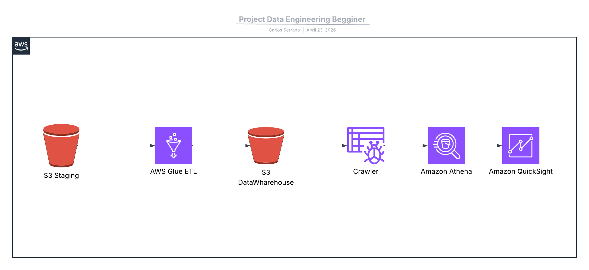
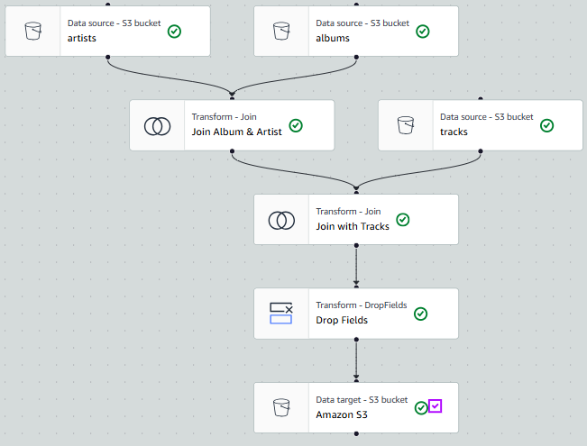
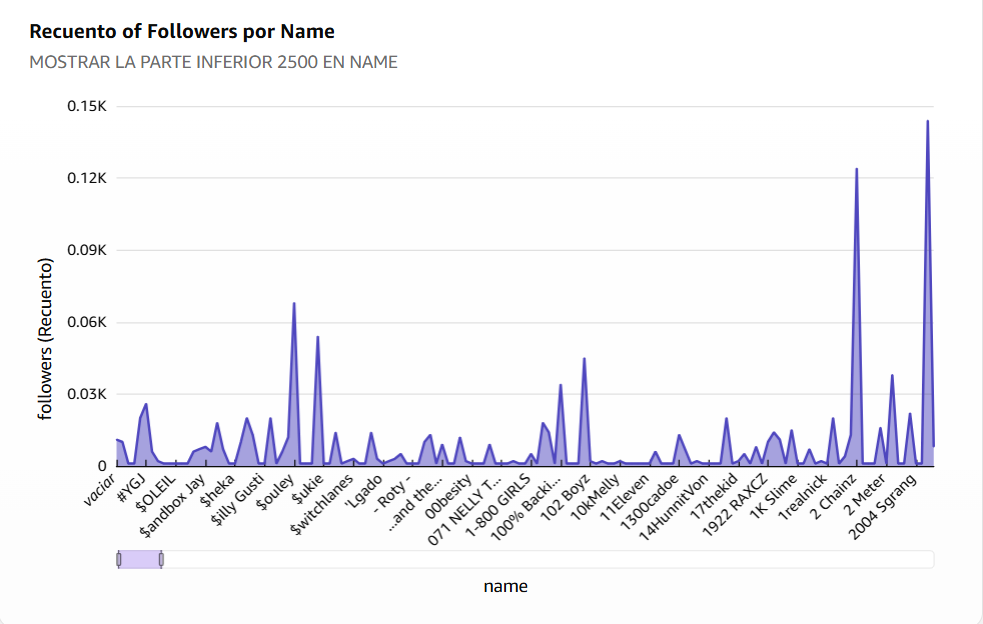
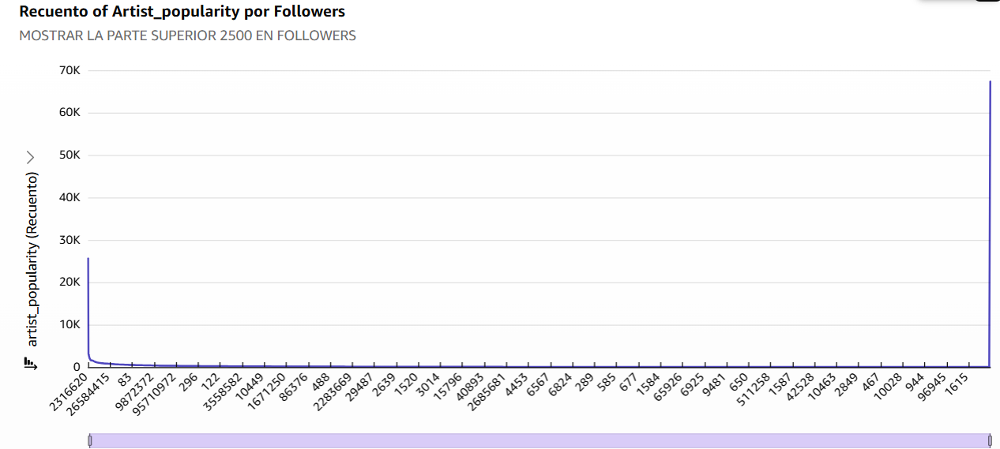
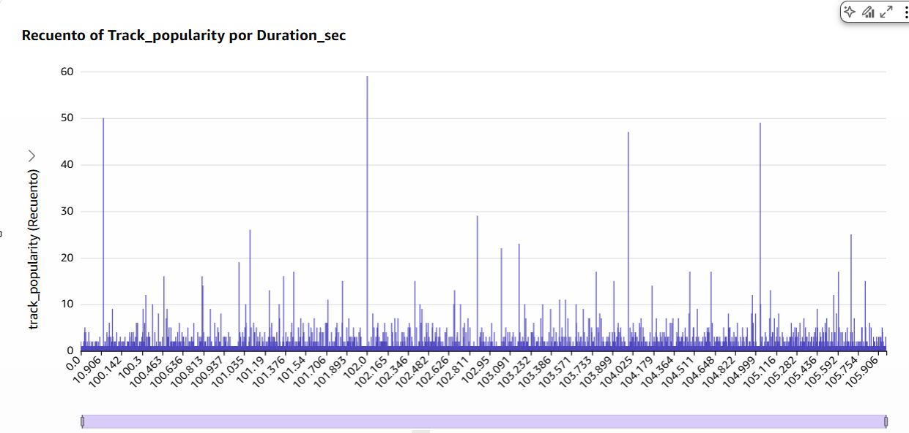

# Spotify Data Engineering Project


## Overview

This project demonstrates a **basic Data Engineering pipeline on AWS**, where raw data is ingested, transformed, cataloged, and queried for analytics and visualization.

The pipeline follows a modern **Data Lake architecture**, using fully managed (serverless) AWS services.

---

## Architecture



### Pipeline Flow

1. Raw data is uploaded to **Amazon S3 (Staging Layer)**
2. Data is processed using **AWS Glue ETL Jobs**
3. Transformed data is stored in **S3 Data Warehouse Layer**
4. **AWS Glue Crawler** catalogs the data
5. Data is queried using **Amazon Athena**
6. Insights are visualized in **Amazon QuickSight**

---

## Dataset

The project uses 3 CSV files:

- `albums.csv`
- `artists.csv`
- `tracks.csv`

These datasets are joined and transformed to create a unified analytical dataset.

---

## IAM Configuration

###  IAM User

- **Username:** `proj1`
- Created to manage AWS services for this project

###  Permissions Assigned

```bash
AmazonS3FullAccess
AmazonGlueConsoleFullAccess
AmazonAthenaFullAccess
AWSQuicksightAthenaAccess
```
---

## Amazon S3 Setup

### Bucket Name

```bash
project-spotify-demo-2026
```

### Folder Structure

```bash
/staging        -> Raw data (input layer)
/datawarehouse  -> Processed data (output layer)
```
### Purpose
* Staging: Temporary storage for raw validated data
* Data Warehouse: Cleaned and transformed data ready for analytics

---

## AWS Glue (ETL)


AWS Glue is used as a serverless ETL service to:

* Extract data from ```/staging```
Transform datasets (joins, cleaning, normalization)
* Load results into ```/datawarehouse```

### Transformations
* Join Albums + Artists
* Join result with Tracks
* Drop unnecessary fields



### Glue IAM Role
The following role was created for Glue:
```bash
AmazonS3FullAccess
AWSGlueServiceRole
```
---

## Amazon Athena

Athena allows running SQL queries directly on S3 data.

### Setup Requirement

Create a dedicated S3 bucket to store query results:

```bash
/athena-results/
```
--- 

## Amazon QuickSight

QuickSight is used for:

* Building dashboards
* Visualizing query results from Athena
* Creating interactive analytics

---

## Key Concepts Demonstrated
* Data Lake Architecture
* ETL Pipelines
* Serverless Data Processing
* Schema Inference
* SQL-based Analytics
* Data Visualization

## Technologies Used
* Amazon S3
* AWS Glue (ETL + Crawler)
* Amazon Athena
* Amazon QuickSight
* IAM (Access Control)

---

## Results QuickSight

This visualization shows the distribution of follower counts across different user names, highlighting the lower segment (bottom 2,500 by name). It helps identify outliers and skewness in follower engagement.

Key Insights
* Most users have a relatively low follower count, indicating a long-tail distribution.
* A few significant spikes suggest high-influence users or anomalies in the dataset.
* Useful for downstream tasks such as segmentation, anomaly detection, or ranking models.





### 1. Popularity vs Followers (Scatter Plot)

Question: Do more followers = more popular tracks?



### 2. Track Duration vs Popularity

Question: Are shorter songs more popular?




_This project is part of my journey into Data Engineering and Cloud Analytics._


---
**Author:** Carlos Serrano  
**Date:** April 23, 2026  